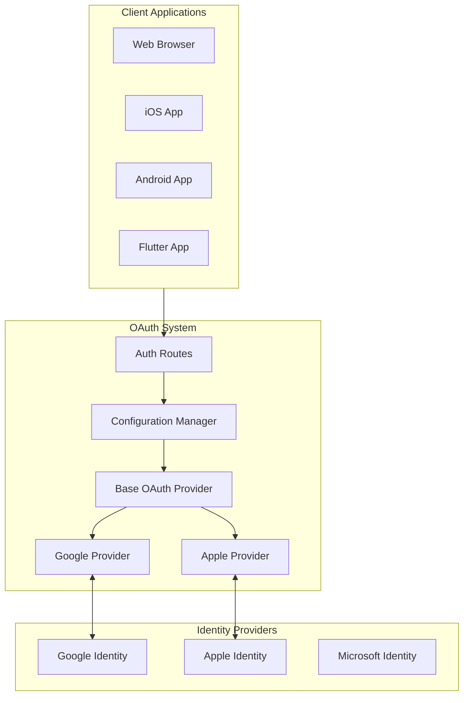
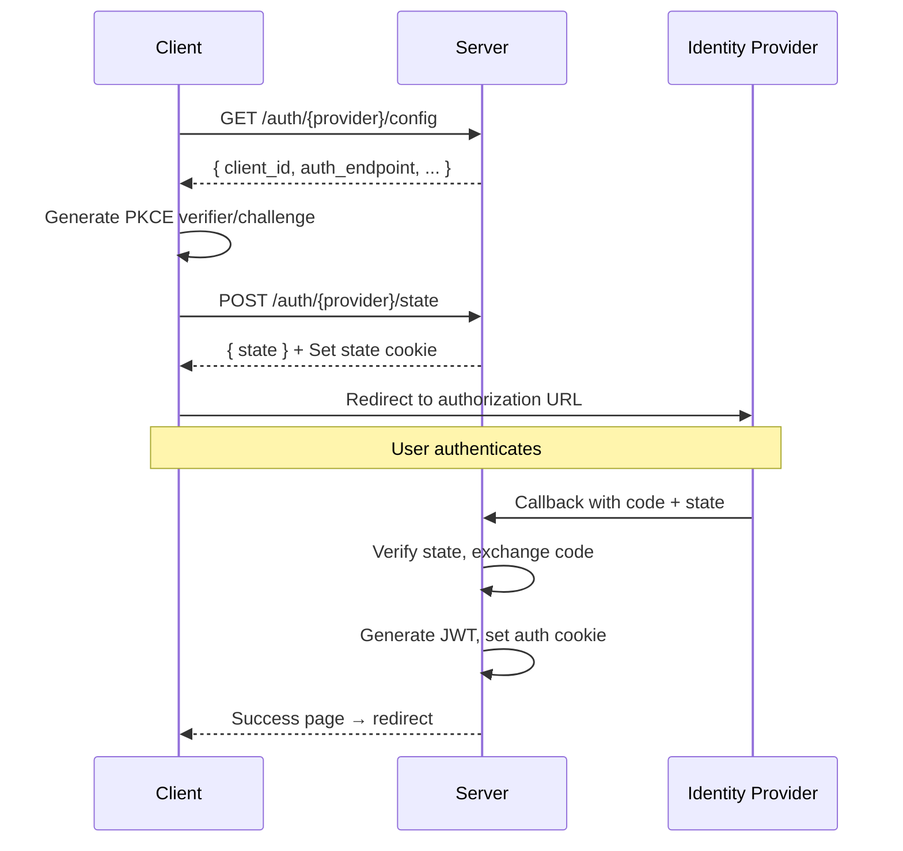

# OAuth Authentication System

This directory contains the OAuth 2.0 / OpenID Connect (OIDC) authentication implementation for the project-euphonia-app.

## Overview

The OAuth system provides a flexible, multi-provider authentication solution supporting:
- **Providers:** Google, Apple, Microsoft
- **Platforms:** Web, iOS, Android
- **Security:** PKCE, secure state management, HttpOnly cookies



## Documentation

Detailed design documentation is available in the `docs/` folder:

| Document | Description |
|----------|-------------|
| [01-server-side-design.md](docs/01-server-side-design.md) | Server architecture: configuration, base OAuth, provider implementations |
| [02-client-side-design.md](docs/02-client-side-design.md) | Client implementation: web JS, Flutter/mobile specification |
| [03-integration-design.md](docs/03-integration-design.md) | Application integration: start_server, auth utilities, protected endpoints |

## Quick Start

### 1. Configuration

Create provider configuration files in `conf.d/`:

```bash
# conf.d/google_web.env
client_id=your-client-id.apps.googleusercontent.com
client_secret=your-client-secret
auth_uri=https://accounts.google.com/o/oauth2/v2/auth
token_uri=https://oauth2.googleapis.com/token
redirect_uri=https://your-domain.com/auth/google/callback
SCOPE=openid email profile
```

### 2. Environment Variables

```bash
# Required
export JWT_SECRET="your-secure-jwt-secret"
export STATE_SECRET_KEY="your-secure-state-secret"

# Optional
export AUTH_CONFIG_DIR="/path/to/conf.d"
export JWT_EXPIRE_HOURS=24
export ADMIN_EMAILS="admin@example.com"
```

### 3. Server Initialization

The OAuth system is initialized automatically in `start_server.py`:

```python
from api.oauth import init_auth_config

auth_config = init_auth_config(
    token_generator_func=generate_jwt_token,
    storage_callback=client_provided_storage_callback,
    client_info_extractor=extract_user_client_info,
    cookie_generator_func=generate_auth_cookies,
    cookie_remover_func=delete_auth_cookies
)
```

## Directory Structure

```
api/oauth/
├── README.md                 # This file
├── __init__.py              # Package exports
├── config.py                # AuthConfig, AuthConfigManager
├── base_oauth.py            # OAuthProvider base class
├── google_stateless.py      # Google OAuth implementation
├── apple_stateless.py       # Apple OAuth implementation
├── jwt_utils.py             # JWT token utilities
├── routes.py                # /auth/login, /auth/logout routes
└── docs/
    ├── 01-server-side-design.md
    ├── 02-client-side-design.md
    └── 03-integration-design.md
```

## API Endpoints

### Common Routes

| Method | Endpoint | Description |
|--------|----------|-------------|
| GET/POST | `/auth/login` | Login page or OAuth info |
| GET/POST | `/auth/logout` | Clear session and cookies |

### Provider Routes

Each provider (google, apple) exposes:

| Method | Endpoint | Description |
|--------|----------|-------------|
| GET | `/auth/{provider}/config?platform=web` | Get client OAuth config |
| POST | `/auth/{provider}/state` | Generate state token |
| GET | `/auth/{provider}/callback` | OAuth callback handler |
| POST | `/auth/{provider}/exchange` | Direct token exchange |

## Authentication Flow



## Security Features

- **PKCE:** Proof Key for Code Exchange prevents authorization code interception
- **Signed State:** Server-signed JWT state tokens prevent CSRF
- **HttpOnly Cookies:** Auth tokens inaccessible to JavaScript
- **Secure Cookies:** HTTPS-only transmission
- **SameSite=Lax:** CSRF protection
- **Short TTL:** 10-minute state token expiration

## Client Integration

### Web (JavaScript)

```javascript
import { AuthManager } from '/web/auth/manager.js';

// Start login flow
await AuthManager.startLogin('google', 'web', { return_url: '/dashboard' });
```

### Flutter/Mobile

See [02-client-side-design.md](docs/02-client-side-design.md#fluttermobile-client-specification) for the mobile client specification.

Key differences:
- Set `platform` to `ios` or `android`
- Callback returns JSON instead of HTML
- Use deep links for app callbacks

## Protected Endpoints

Use the `get_auth_context` dependency:

```python
from api.auth_util import get_auth_context

@router.get('/protected')
async def protected_endpoint(auth_context: dict = Depends(get_auth_context)):
    if not auth_context['authenticated']:
        raise HTTPException(status_code=401)
    
    va_dir = auth_context['va_dir']
    is_admin = auth_context['is_Admin']
    # ... handle request
```

## Adding a New Provider

1. Create `{provider}_stateless.py` based on existing providers
2. Add configuration file: `conf.d/{provider}_web.env`
3. Register router in FastAPI app
4. Add client provider class in `web/auth/providers/{provider}.js`
5. Update `web/auth/index.js` provider registry

## Troubleshooting

| Issue | Solution |
|-------|----------|
| "No configuration found" | Check `conf.d/` has `{provider}_{platform}.env` |
| "Invalid state parameter" | State cookie expired (10 min) or cleared |
| "Google token endpoint error" | Verify client_secret, check Google Console |
| "Apple auth key not found" | Verify AUTH_KEY_PATH points to .p8 file |

## Related Files

- `api/start_server.py` - OAuth initialization
- `api/auth_util.py` - JWT generation, auth context
- `api/web/auth.html` - Login page
- `api/web/auth/` - Client-side OAuth scripts
- `conf.d/` - Provider configuration files
