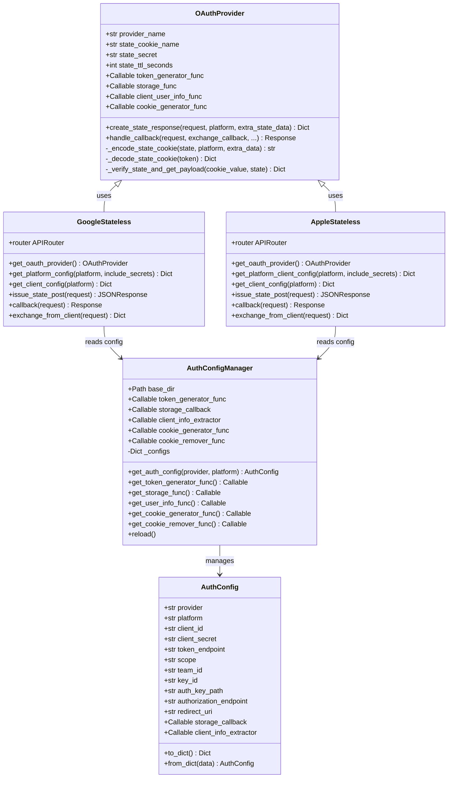
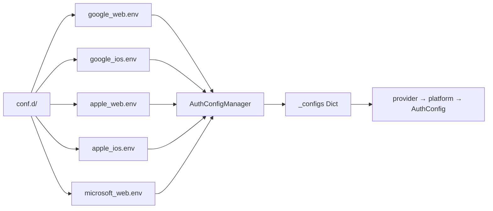
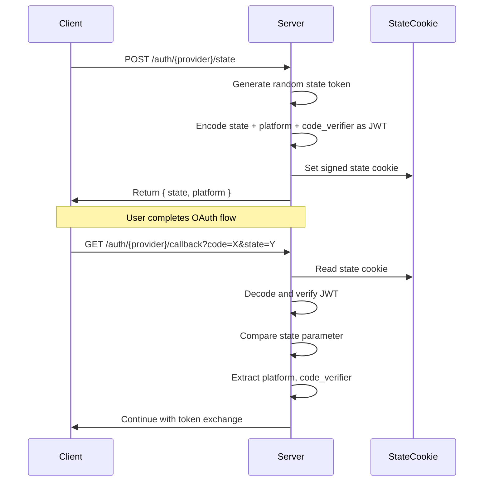
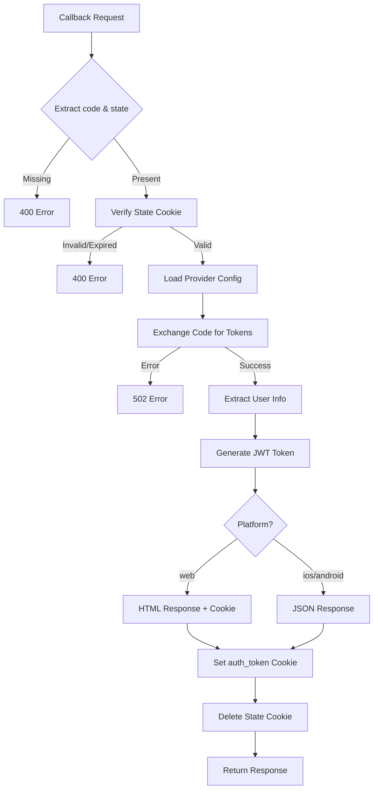
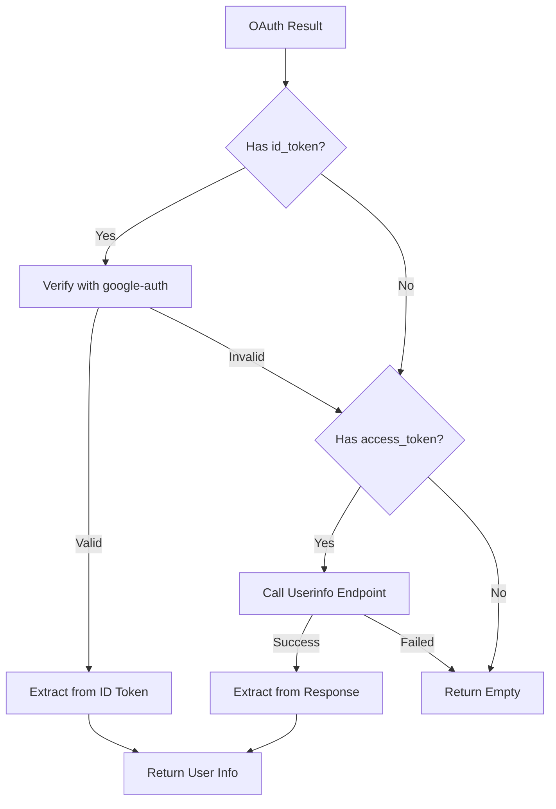
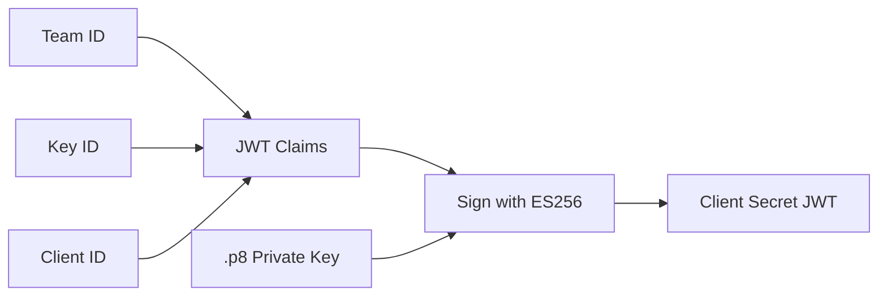
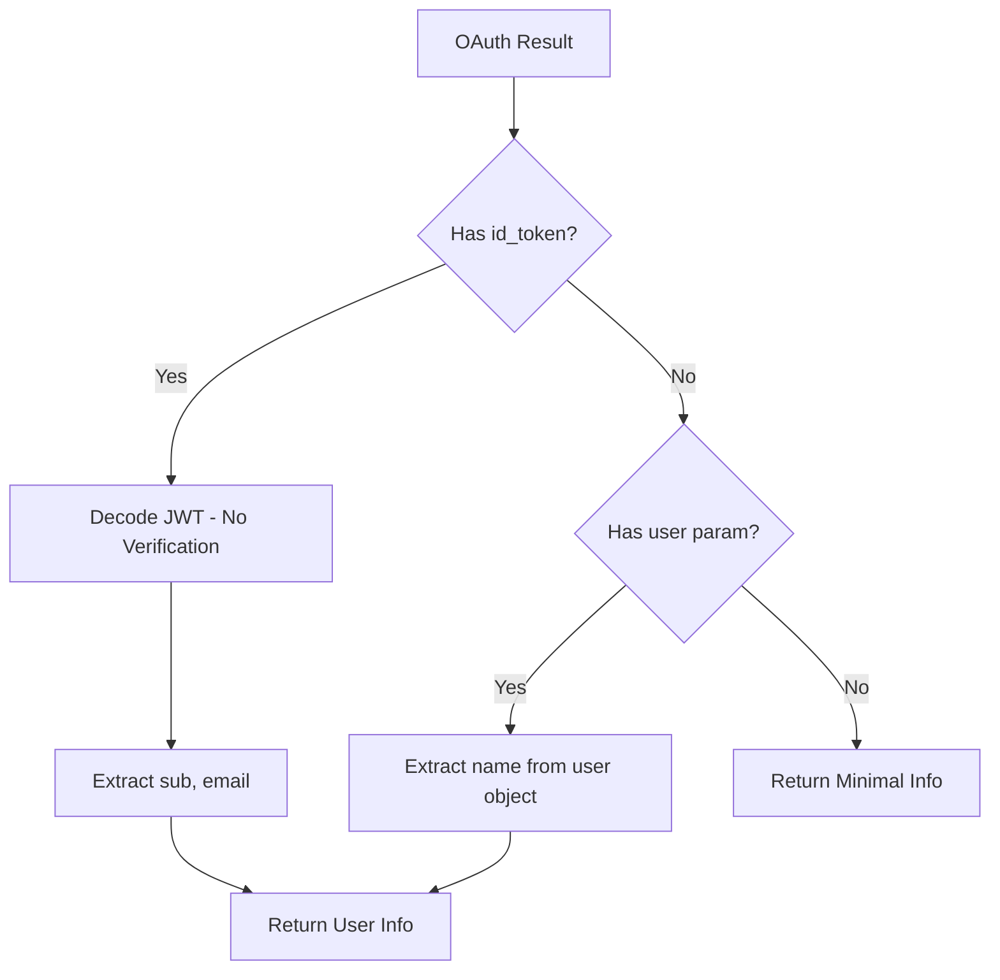

# OAuth Server-Side Design

This document describes the server-side OAuth implementation architecture, including configuration management, base OAuth provider abstraction, and individual provider integrations.

## Architecture Overview



## Component Details

### 1. Configuration System (`config.py`)

The configuration system provides a flexible, file-based approach to managing OAuth credentials for multiple providers and platforms.

#### AuthConfig Dataclass

The `AuthConfig` dataclass holds all OAuth configuration parameters:

| Field | Type | Description |
|-------|------|-------------|
| `provider` | str | Provider name (google, apple, microsoft) |
| `platform` | str | Target platform (web, ios, android) |
| `client_id` | str | OAuth client ID |
| `client_secret` | str | OAuth client secret |
| `token_endpoint` | str | Token exchange endpoint URL |
| `scope` | str | OAuth scopes (default: "openid email profile") |
| `team_id` | str | Apple Team ID (Apple only) |
| `key_id` | str | Apple Key ID (Apple only) |
| `auth_key_path` | str | Path to Apple .p8 key file (Apple only) |
| `authorization_endpoint` | str | Authorization URL |
| `redirect_uri` | str | OAuth redirect URI |
| `storage_callback` | Callable | User data storage handler |
| `client_info_extractor` | Callable | User info extraction handler |

#### AuthConfigManager

The `AuthConfigManager` loads configurations from `.env` files in the `conf.d/` directory:



**File Naming Convention:** `{provider}_{platform}.env`

**Example Configuration File (`google_web.env`):**
```ini
client_id=your-google-client-id.apps.googleusercontent.com
client_secret=your-google-client-secret
auth_uri=https://accounts.google.com/o/oauth2/v2/auth
token_uri=https://oauth2.googleapis.com/token
redirect_uri=https://your-domain.com/auth/google/callback
SCOPE=openid email profile
```

#### Initialization

The configuration system is initialized via `init_auth_config()`:

```python
init_auth_config(
    base_dir=Path(config_dir),           # Optional: config directory path
    token_generator_func=generate_jwt,    # JWT token generation
    storage_callback=store_user,          # User data persistence
    client_info_extractor=extract_info,   # Client display info
    cookie_generator_func=gen_cookies,    # Auth cookie config
    cookie_remover_func=del_cookies       # Cookie deletion config
)
```

### 2. Base OAuth Provider (`base_oauth.py`)

The `OAuthProvider` class provides a reusable foundation for all OAuth providers.

#### State Management



**State Cookie Structure (JWT Payload):**
```json
{
  "state": "random-32-byte-string",
  "platform": "web",
  "code_verifier": "pkce-verifier-string",
  "return_url": "/dashboard",
  "iat": 1704200000,
  "exp": 1704200600
}
```

#### Callback Handler Flow



### 3. Google Provider (`google_stateless.py`)

#### Endpoints

| Method | Path | Description |
|--------|------|-------------|
| GET | `/auth/google/config` | Get client-safe OAuth config |
| POST | `/auth/google/state` | Generate state token with PKCE support |
| GET | `/auth/google/callback` | Handle OAuth callback |
| POST | `/auth/google/exchange` | Direct token exchange (mobile) |

#### User Info Extraction

Google user info is extracted from:
1. **ID Token** (preferred) - Verified using `google-auth` library
2. **Userinfo Endpoint** (fallback) - `https://www.googleapis.com/oauth2/v2/userinfo`



**Extracted User Info:**
```json
{
  "id": "google-user-id",
  "email": "user@gmail.com",
  "name": "John Doe",
  "given_name": "John",
  "family_name": "Doe",
  "picture": "https://...",
  "locale": "en",
  "email_verified": true,
  "provider": "google"
}
```

### 4. Apple Provider (`apple_stateless.py`)

#### Endpoints

| Method | Path | Description |
|--------|------|-------------|
| GET | `/auth/apple/config` | Get client-safe OAuth config |
| POST | `/auth/apple/state` | Generate state token with PKCE support |
| GET | `/auth/apple/callback` | Handle OAuth callback |
| POST | `/auth/apple/exchange` | Direct token exchange (mobile) |

#### Client Secret Generation

Apple requires a dynamically generated client secret (JWT):



**Client Secret JWT Structure:**
```json
{
  "iss": "TEAM_ID",
  "iat": 1704200000,
  "exp": 1704201800,
  "aud": "https://appleid.apple.com",
  "sub": "CLIENT_ID"
}
```

#### User Info Extraction

Apple provides limited user info due to privacy focus:



**Note:** Apple only provides the user's name on first authorization. Subsequent logins only include `sub` and `email`.

### 5. JWT Token Generation (`jwt_utils.py`)

The default JWT token generator creates application session tokens:

```python
{
    "sub": "user-id",
    "email": "user@example.com",
    "name": "User Name",
    "platform": "web",
    "provider": "google",
    "iat": 1704200000,
    "exp": 1704286400
}
```

**Configuration:**
- Algorithm: HS256
- Secret: `JWT_SECRET` environment variable
- Expiration: 24 hours (configurable via `JWT_EXPIRE_HOURS`)

### 6. Routes (`routes.py`)

The main auth router provides entry points:

| Method | Path | Description |
|--------|------|-------------|
| GET/POST | `/auth/login` | Serve login page or return OAuth info |
| GET/POST | `/auth/logout` | Clear session and cookies |

## Security Considerations

1. **State Token Security**
   - State tokens are JWTs signed with `STATE_SECRET_KEY`
   - 10-minute TTL prevents replay attacks
   - Cookie is HttpOnly, Secure, SameSite=Lax

2. **PKCE Support**
   - Code verifier stored in state JWT (server-side)
   - Code challenge sent to authorization endpoint
   - Prevents authorization code interception

3. **Token Security**
   - Auth tokens stored in HttpOnly cookies
   - Secure flag ensures HTTPS-only transmission
   - SameSite=Lax prevents CSRF attacks

4. **Configuration Security**
   - Client secrets never exposed to clients
   - `/config` endpoints only return public parameters
   - Private keys stored in secure file paths

## Environment Variables

| Variable | Description | Default |
|----------|-------------|---------|
| `AUTH_CONFIG_DIR` | Config files directory | `conf.d/` |
| `STATE_SECRET_KEY` | State JWT signing key | Required |
| `GOOGLE_STATE_SECRET_KEY` | Google-specific state key | Falls back to STATE_SECRET_KEY |
| `APPLE_STATE_SECRET_KEY` | Apple-specific state key | Falls back to STATE_SECRET_KEY |
| `JWT_SECRET` | Session JWT signing key | Required |
| `JWT_EXPIRE_HOURS` | Session token expiration | 24 |
| `ADMIN_EMAILS` | Comma-separated admin emails | Empty |
