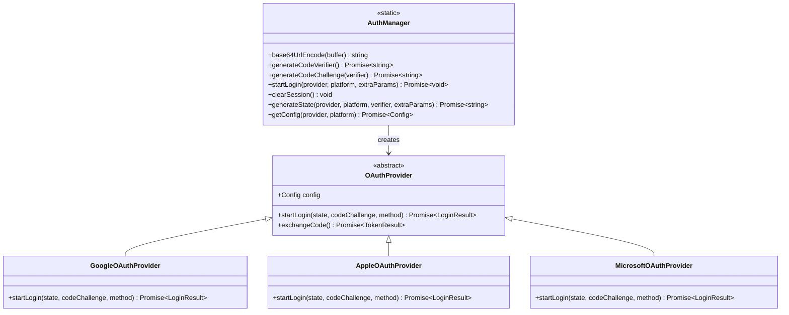
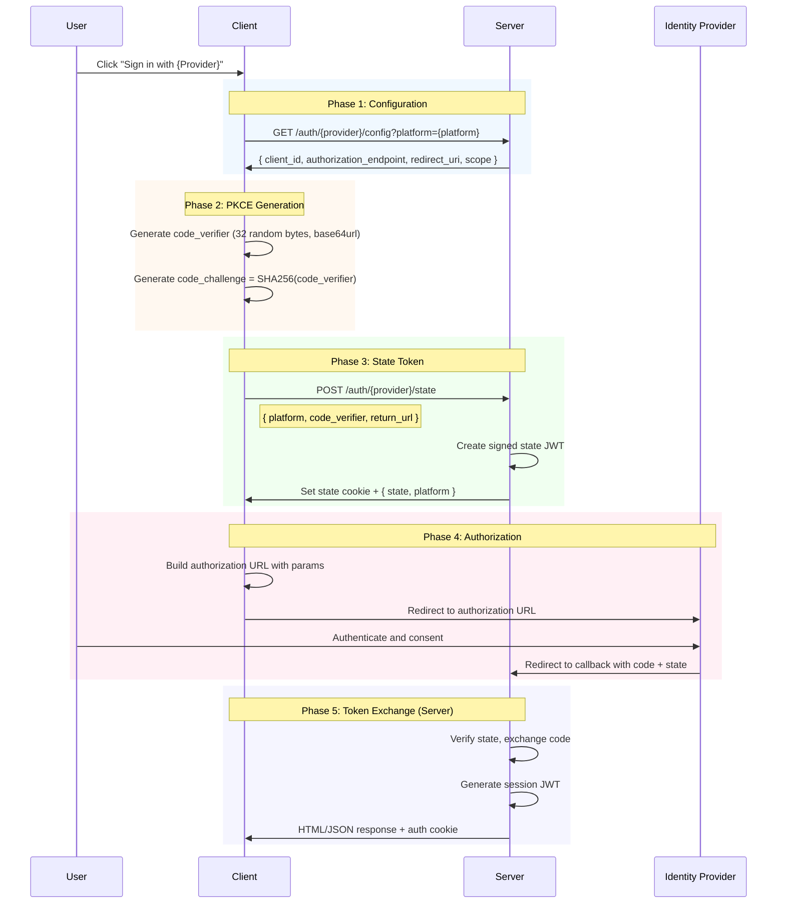
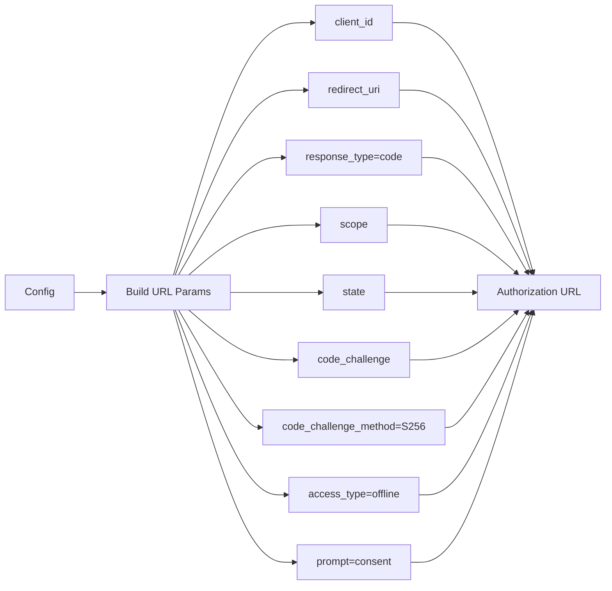
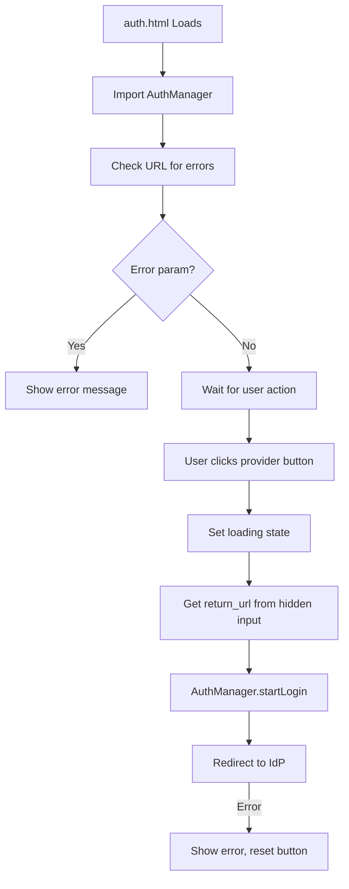
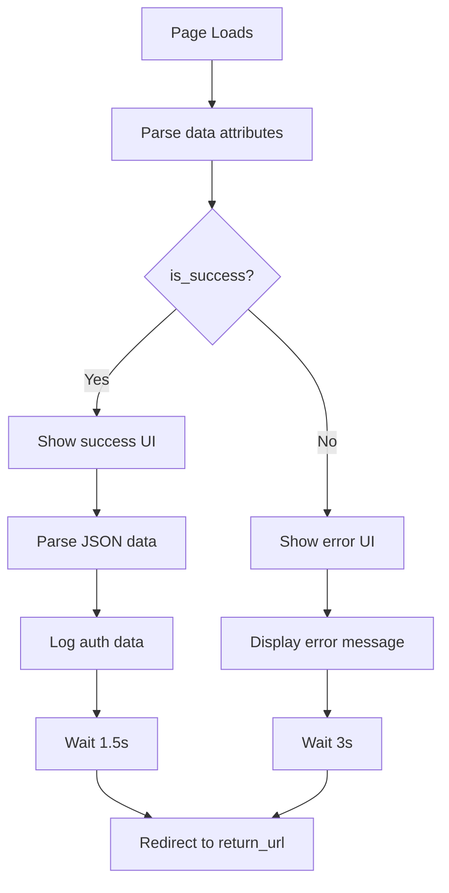
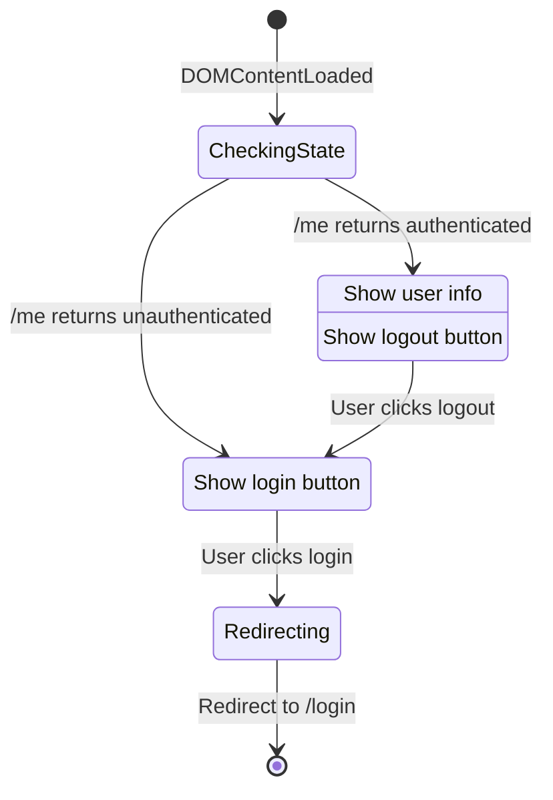
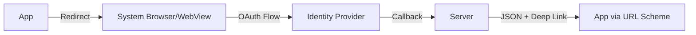
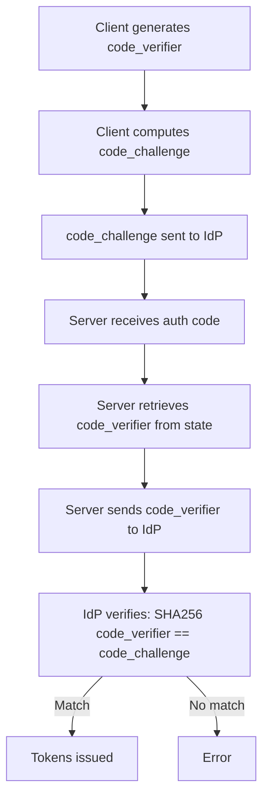

# OAuth Client-Side Design

This document describes the client-side OAuth implementation, focusing on the web client architecture. The design is structured as a specification that can be implemented by any client platform (Web, Flutter, iOS, Android) without server-side changes.

## Architecture Overview



## Client Implementation Specification

### Overview

The client is responsible for:
1. Fetching OAuth configuration from the server
2. Generating PKCE code verifier and challenge
3. Requesting a server-signed state token
4. Constructing and redirecting to the authorization URL
5. Handling the authentication result

### Flow Diagram



## Web Client Implementation

### File Structure

```
api/web/
├── auth.html                 # Login page UI
├── auth/
│   ├── index.js             # Provider factory
│   ├── manager.js           # AuthManager class
│   ├── auth_result.html     # Callback result page
│   └── providers/
│       ├── base.js          # OAuthProvider base class
│       ├── google.js        # Google provider
│       ├── apple.js         # Apple provider
│       └── microsoft.js     # Microsoft provider
├── login_auth.js            # Login state management
└── login_partial.html       # Reusable login UI component
```

### Core Components

#### 1. AuthManager (`manager.js`)

The `AuthManager` is a static class handling the OAuth flow orchestration.

**Key Methods:**

| Method | Description | Parameters |
|--------|-------------|------------|
| `startLogin(provider, platform, extraParams)` | Initiates OAuth flow | provider: string, platform: string, extraParams: object |
| `generateCodeVerifier()` | Creates PKCE verifier | None |
| `generateCodeChallenge(verifier)` | Creates PKCE challenge | verifier: string |
| `generateState(provider, platform, verifier, extraParams)` | Requests state from server | Multiple |
| `getConfig(provider, platform)` | Fetches OAuth config | provider: string, platform: string |
| `clearSession()` | Clears stored OAuth data | None |

**PKCE Implementation:**

```javascript
// Generate 32 random bytes, base64url encode
static async generateCodeVerifier() {
    const array = new Uint8Array(32);
    window.crypto.getRandomValues(array);
    return this.base64UrlEncode(array);
}

// SHA-256 hash, base64url encode
static async generateCodeChallenge(verifier) {
    const data = new TextEncoder().encode(verifier);
    const digest = await window.crypto.subtle.digest('SHA-256', data);
    return this.base64UrlEncode(new Uint8Array(digest));
}
```

#### 2. Provider Base Class (`providers/base.js`)

```javascript
export class OAuthProvider {
    constructor(config) {
        this.config = config;
    }

    async startLogin() {
        throw new Error('Not implemented');
    }

    async exchangeCode() {
        throw new Error('Not implemented');
    }
}
```

#### 3. Provider Implementations

**Google Provider (`providers/google.js`):**



**Apple Provider (`providers/apple.js`):**

Apple uses `response_mode: 'form_post'` which causes the callback to be a POST request:

```javascript
const params = new URLSearchParams({
    client_id: this.config.client_id,
    redirect_uri: this.config.redirect_uri,
    response_type: 'code',
    scope: this.config.scope || 'name email',
    state,
    code_challenge: codeChallenge,
    code_challenge_method: codeChallengeMethod,
    response_mode: 'form_post'  // Apple-specific
});
```

**Microsoft Provider (`providers/microsoft.js`):**

```javascript
const params = new URLSearchParams({
    client_id: this.config.client_id,
    response_type: 'code',
    redirect_uri: this.config.redirect_uri,
    scope: this.config.scope || 'openid profile email',
    state,
    code_challenge: codeChallenge,
    code_challenge_method: codeChallengeMethod,
    response_mode: 'query'
});
```

#### 4. Provider Factory (`index.js`)

```javascript
const PROVIDERS = {
    google: GoogleOAuthProvider,
    apple: AppleOAuthProvider,
    microsoft: MicrosoftOAuthProvider
};

export function getOAuthProvider(provider, config) {
    const ProviderClass = PROVIDERS[provider.toLowerCase()];
    if (!ProviderClass) {
        throw new Error(`Unsupported OAuth provider: ${provider}`);
    }
    return new ProviderClass(config);
}
```

### Login Page (`auth.html`)

The login page provides the UI for initiating OAuth flows:



**Button Click Handler:**

```javascript
async function handleLogin(provider) {
    const button = document.getElementById(`login${provider}`);
    try {
        setLoading(button, true);
        const returnUrl = document.getElementById('returnUrl').value;
        await AuthManager.startLogin(provider, 'web', { return_url: returnUrl });
    } catch (err) {
        showError(err.message || 'Failed to sign in');
    } finally {
        setLoading(button, false);
    }
}
```

### Callback Result Page (`auth_result.html`)

After OAuth callback processing, the server renders this page:



**Template Variables:**
- `{{ success_html_title }}` - Page title
- `{{ success_html_heading }}` - Success message heading
- `{{ is_success }}` - Boolean success flag
- `{{ error_message }}` - Error description
- `{{ return_url }}` - Post-auth redirect URL
- `{{ json_data }}` - JSON payload with user info and token

### Login State Management (`login_auth.js`)

Handles post-authentication state in the main application:



## Flutter/Mobile Client Specification

The same server APIs support native mobile clients. Key differences:

### Platform Parameter

Set `platform` to `ios` or `android` instead of `web`:

```dart
// Flutter example
final config = await fetchConfig('google', 'ios');
final state = await generateState('google', 'ios', codeVerifier, {});
```

### Response Format

For non-web platforms, the callback returns JSON instead of HTML:

```json
{
    "success": true,
    "data": {
        "user_info": {
            "success_html_title": "iOS Authentication Successful",
            "va-dir": "google_123_abc",
            "Name": "John Doe",
            "Provider": "google",
            "Platform": "ios"
        },
        "timestamp": "2024-01-02T12:00:00Z",
        "provider": "google",
        "token": "eyJhbG..."
    }
}
```

### Deep Link Handling

Mobile apps should register custom URL schemes for callbacks:



**Recommended Approach:**
1. Use a server callback URL
2. Server exchanges code for tokens
3. Server returns JSON with token
4. App extracts token from response

### API Endpoints for Mobile

| Endpoint | Method | Use Case |
|----------|--------|----------|
| `/auth/{provider}/config?platform=ios` | GET | Get OAuth config |
| `/auth/{provider}/state` | POST | Get state token |
| `/auth/{provider}/callback` | GET | Server handles callback |
| `/auth/{provider}/exchange` | POST | Direct token exchange (optional) |

### Direct Token Exchange (Optional)

For apps handling the callback directly:

```dart
POST /auth/google/exchange
{
    "code": "authorization_code",
    "code_verifier": "pkce_verifier",
    "redirect_uri": "com.yourapp://callback",
    "platform": "ios"
}
```

## Security Considerations

### PKCE (Proof Key for Code Exchange)

All clients must implement PKCE:



### State Token Security

- State is generated server-side and signed
- Client never sees the state signing key
- State cookie is HttpOnly (inaccessible to JavaScript)
- Short TTL (10 minutes) prevents replay

### Return URL Validation

- `return_url` is stored in server-side state
- Client cannot modify the return destination after state creation
- Prevents open redirect vulnerabilities

## Error Handling

### Client-Side Errors

| Error | Handling |
|-------|----------|
| Config fetch failed | Show "Service unavailable" message |
| State generation failed | Fall back to client-side state (degraded security) |
| Provider redirect failed | Show error, allow retry |

### Server-Side Errors

| HTTP Status | Meaning | Client Action |
|-------------|---------|---------------|
| 400 | Invalid parameters/state | Show error, restart flow |
| 401 | Unauthorized | Redirect to login |
| 500 | Server error | Show generic error |
| 502 | IdP error | Show "Provider unavailable" |

## Storage Keys

Web clients use these storage keys:

| Key | Storage | Purpose |
|-----|---------|---------|
| `pkce_verifier` | sessionStorage | PKCE code verifier (cleared after use) |
| `oauth_config` | sessionStorage | Cached OAuth config |
| `oauth_state` | sessionStorage | State token reference |
| `authenticated` | sessionStorage | Auth status flag |
