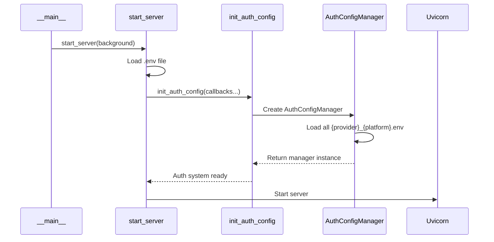
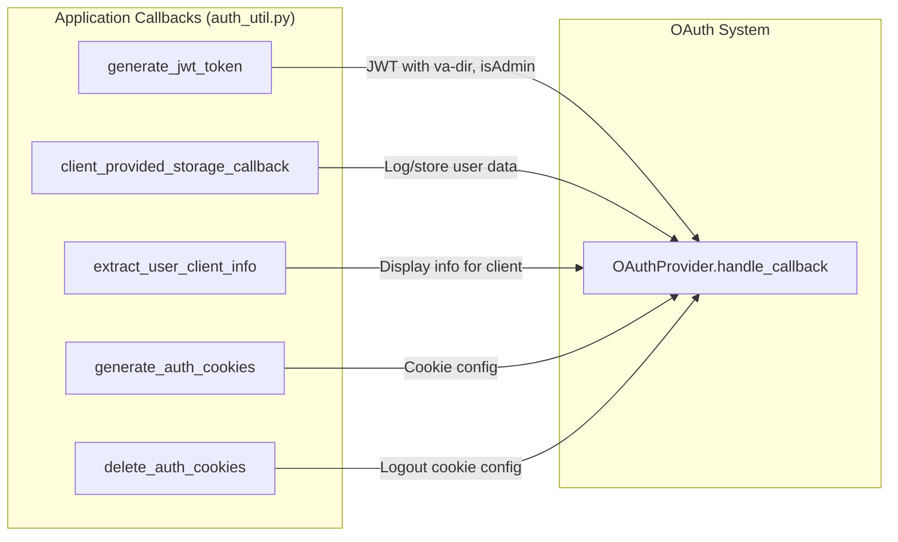
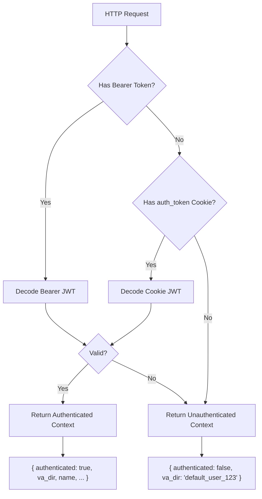
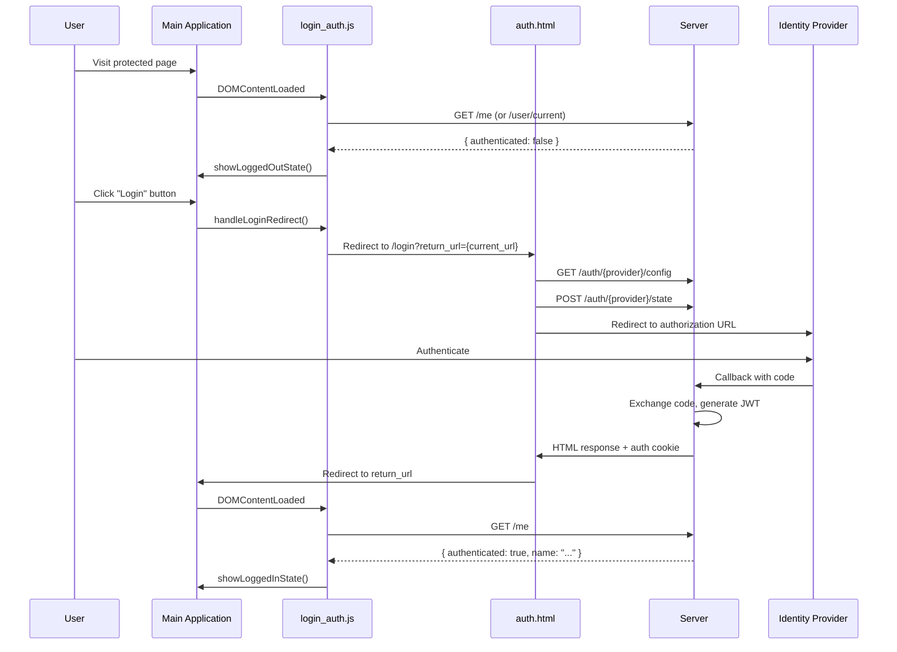
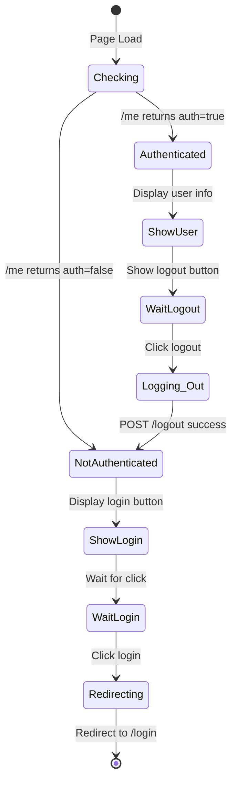
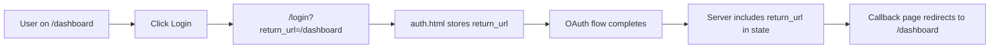
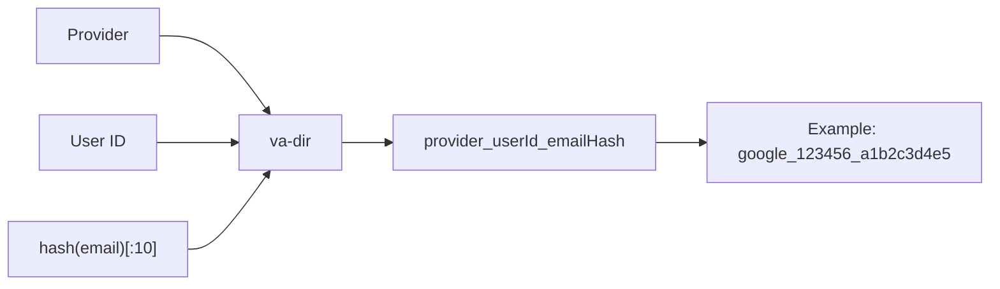
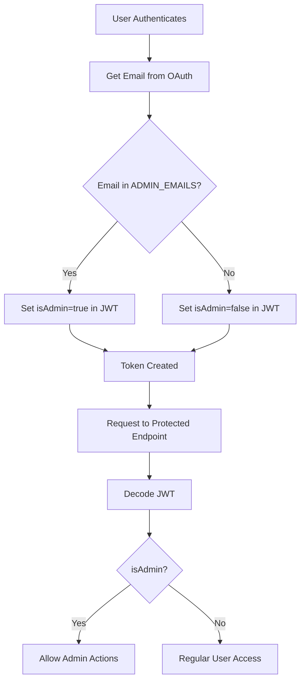
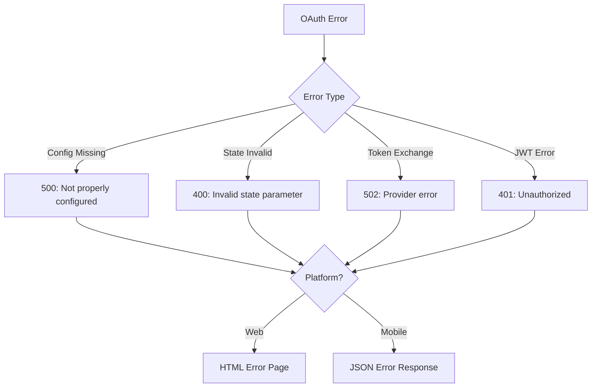

# OAuth Integration Design

This document describes how the OAuth system integrates with the rest of the application, both on the server side (via `start_server.py`) and on the client side (via `auth.html` and related scripts).

## System Integration Overview

```mermaid
flowchart TB
    subgraph Server ["Server Layer"]
        SS[start_server.py] --> IC[init_auth_config]
        IC --> ACM[AuthConfigManager]
        ACM --> GP[Google Provider]
        ACM --> AP[Apple Provider]
        
        AU[auth_util.py] --> JWT[JWT Generation]
        AU --> Cookie[Cookie Management]
        AU --> UserInfo[User Info Extraction]
        AU --> Storage[Storage Callback]
        
        IC -.->|Injects| JWT
        IC -.->|Injects| Cookie
        IC -.->|Injects| UserInfo
        IC -.->|Injects| Storage
        
        Routes[routes.py] --> Login[/auth/login]
        Routes --> Logout[/auth/logout]
        
        GP --> Callback1[/auth/google/callback]
        AP --> Callback2[/auth/apple/callback]
    end
    
    subgraph Client ["Client Layer"]
        AuthHTML[auth.html] --> AM[AuthManager]
        AM --> Providers[Provider Classes]
        
        LA[login_auth.js] --> LoginState[Login State Check]
        LA --> LogoutHandler[Logout Handler]
        
        MainApp[Main Application] --> LA
        MainApp --> AuthContext[Auth Context Dependency]
    end
    
    subgraph External ["External"]
        GI[Google Identity]
        AI[Apple Identity]
        MI[Microsoft Identity]
    end
    
    AuthHTML -->|Redirect| GI
    AuthHTML -->|Redirect| AI
    AuthHTML -->|Redirect| MI
    
    GI -->|Callback| Callback1
    AI -->|Callback| Callback2
```

## Server-Side Integration

### Application Startup (`start_server.py`)

The OAuth system is initialized during server startup:



**Initialization Code:**

```python
from api.oauth import init_auth_config
from api.auth_util import (
    generate_jwt_token,
    client_provided_storage_callback,
    extract_user_client_info,
    generate_auth_cookies,
    delete_auth_cookies
)

def run_uvicorn():
    # Initialize auth config with application-specific callbacks
    auth_config = init_auth_config(
        base_dir=Path(config_dir),
        token_generator_func=generate_jwt_token,
        storage_callback=client_provided_storage_callback,
        client_info_extractor=extract_user_client_info,
        cookie_generator_func=generate_auth_cookies,
        cookie_remover_func=delete_auth_cookies
    )
```

### Callback Functions

The application injects behavior via callback functions:



#### 1. Token Generator (`generate_jwt_token`)

Creates application-specific JWT tokens:

```python
def generate_jwt_token(user_info: Dict, platform: str, provider_name: str) -> str:
    token_payload = {
        'sub': user_info.get('id', ''),
        'name': user_info.get('name', ''),
        'isAdmin': isUserAdmin(user_info.get('email', '')),
        'va-dir': getVaDir(user_info.get('id'), user_info.get('email'), provider_name),
        'platform': platform,
        'iat': datetime.now(timezone.utc),
        'exp': datetime.now(timezone.utc) + timedelta(hours=24)
    }
    return jwt.encode(token_payload, JWT_SECRET, algorithm='HS256')
```

**Token Payload Structure:**

| Field | Source | Description |
|-------|--------|-------------|
| `sub` | OAuth user ID | Subject identifier |
| `name` | OAuth profile | Display name |
| `isAdmin` | ADMIN_EMAILS env | Admin flag |
| `va-dir` | Computed | Voice Assist directory ID |
| `platform` | OAuth flow | Client platform |
| `iat` | Server time | Issued at timestamp |
| `exp` | Server time + 24h | Expiration timestamp |

#### 2. Storage Callback (`client_provided_storage_callback`)

Handles user data persistence after authentication:

```python
def client_provided_storage_callback(user_info: Dict, platform: str, provider_name: str) -> None:
    user_id = user_info.get('id', '')
    email = user_info.get('email', '')
    va_dir = getVaDir(user_id, email, provider_name)
    
    logger.info(f"User authenticated - ID: {user_id}, Provider: {provider_name}")
    
    # TODO: Implement actual storage logic
    # - Store in database
    # - Update analytics
    # - Trigger business logic
```

#### 3. User Info Extractor (`extract_user_client_info`)

Prepares user information for client display:

```python
def extract_user_client_info(user_info: Dict, platform: str, provider_name: str) -> Dict:
    return {
        "success_html_title": "Web Authentication Successful",
        "success_html_heading": f"Welcome {name}! You've signed in with {provider}",
        "va-dir": getVaDir(user_id, email, provider_name),
        "Name": name,
        "Provider": provider_name,
        "Platform": platform,
        "User_ID": user_id,
    }
```

#### 4. Cookie Generator (`generate_auth_cookies`)

Configures authentication cookies:

```python
def generate_auth_cookies(token: str, platform: str, provider_name: str) -> Dict:
    return {
        "key": "auth_token",
        "value": token,
        "httponly": True,
        "secure": True,
        "samesite": 'lax',
        "max_age": JWT_EXPIRE_HOURS * 3600,
        "domain": None,
        "path": '/',
    }
```

### Authentication Context Dependency

Protected endpoints use the `get_auth_context` dependency:



**Usage in Endpoints:**

```python
from api.auth_util import get_auth_context

@router.get('/protected-endpoint')
async def protected_endpoint(auth_context: dict = Depends(get_auth_context)):
    if not auth_context['authenticated']:
        raise HTTPException(status_code=401, detail="Authentication required")
    
    user_va_dir = auth_context['va_dir']
    is_admin = auth_context['is_Admin']
    # ... use authentication context
```

**Auth Context Fields:**

| Field | Type | Description |
|-------|------|-------------|
| `authenticated` | bool | Whether user is authenticated |
| `va_dir` | str | Voice Assist directory ID |
| `credentials` | HTTPAuthorizationCredentials | Raw bearer credentials |
| `auth_source` | str | 'bearer', 'cookie', or 'none' |
| `is_Admin` | bool | Admin flag from token |
| `name` | str | User display name |
| `user_id` | str | User identifier |

### User Info Endpoint

The `/user/current` endpoint exposes authentication state:

```python
@auth_router.get('/current')
async def get_current_user_info(auth_context: dict = Depends(get_auth_context)):
    if not auth_context['authenticated']:
        return {"authenticated": False}
    
    return {
        "authenticated": True,
        "name": auth_context['name'],
        "va-dir": auth_context['va_dir'],
        "auth_source": auth_context['auth_source']
    }
```

## Client-Side Integration

### Login Flow Integration



### Login State Management (`login_auth.js`)

Integrates authentication state with the main application:



**Key Functions:**

| Function | Purpose |
|----------|---------|
| `checkLoginState()` | Check authentication via `/me` endpoint |
| `showLoggedInState(userData)` | Display user info and logout button |
| `showLoggedOutState()` | Display login button |
| `handleLoginRedirect()` | Redirect to `/login` with return URL |
| `handleLogout()` | POST to `/logout` and clear local state |

### PostMessage Communication

For popup-based flows (optional), `login_auth.js` listens for auth messages:

```javascript
window.addEventListener('message', function(event) {
    if (event.origin !== window.location.origin) return;
    
    const { type, token, error, data } = event.data;
    
    if (type === 'AUTH_SUCCESS') {
        showMessage('Authentication successful!', 'success');
        checkLoginState();  // Refresh UI
    } else if (type === 'AUTH_ERROR') {
        showMessage(`Authentication failed: ${error}`, 'error');
    }
});
```

### Return URL Handling



**Server-Side Template:**
```html
<input type="hidden" id="returnUrl" value="{{ return_url if return_url else '/' }}">
```

**Client-Side Usage:**
```javascript
const returnUrl = document.getElementById('returnUrl').value;
await AuthManager.startLogin(provider, 'web', { return_url: returnUrl });
```

## VA-Dir (Voice Assist Directory) System

The `va-dir` is a unique identifier for user-specific data storage:



**Generation Logic:**
```python
def getVaDir(user_id: str, email: str, provider: str) -> str:
    email_suffix = str(hash(email.replace('@', '_')))[:10] if email else str(hash(user_id))[:10]
    return f"{provider}_{user_id}_{email_suffix}"
```

**Usage:**
- Directory path for user-specific files
- Database partition key
- Session identification

## Admin System Integration



**Configuration:**
```bash
ADMIN_EMAILS=admin@example.com,superuser@example.com
```

## Logout Flow

```mermaid
sequenceDiagram
    participant User
    participant Client
    participant Server

    User->>Client: Click Logout
    Client->>Server: POST /auth/logout (Accept: application/json)
    
    Server->>Server: Get cookie_remover_func
    Server->>Server: Generate deletion cookie config
    
    Server-->>Client: JSON { message, redirect: "/" }
    Note over Server,Client: Set-Cookie: auth_token=; max-age=0
    
    Client->>Client: Clear localStorage
    Client->>Client: Clear sessionStorage
    Client->>Client: Clear document.cookie
    Client->>Client: Update UI to logged out
    Client->>Client: Redirect to "/"
```

## Environment Configuration

### Required Variables

| Variable | Used By | Description |
|----------|---------|-------------|
| `AUTH_CONFIG_DIR` | start_server.py | Path to OAuth config files |
| `JWT_SECRET` | auth_util.py | JWT signing secret |
| `JWT_EXPIRE_HOURS` | auth_util.py | Token expiration (default: 24) |
| `STATE_SECRET_KEY` | providers | State JWT signing secret |
| `ADMIN_EMAILS` | auth_util.py | Comma-separated admin emails |

### Configuration File Location

```
project-root/
├── conf.d/                    # OAuth config files
│   ├── google_web.env
│   ├── google_ios.env
│   ├── apple_web.env
│   └── ...
├── api/
│   ├── start_server.py
│   ├── auth_util.py
│   └── oauth/
│       └── ...
```

## Error Handling Integration

### Server-Side Errors



### Client-Side Error Display

```javascript
// auth.html error handling
const urlParams = new URLSearchParams(window.location.search);
const error = urlParams.get('error');

if (error) {
    showError(decodeURIComponent(error));
    window.history.replaceState({}, document.title, window.location.pathname);
}
```

## Testing Integration Points

### Authentication Context Testing

```python
# Mock authenticated context
@pytest.fixture
def authenticated_context():
    return {
        'authenticated': True,
        'va_dir': 'google_123_abc',
        'is_Admin': False,
        'name': 'Test User',
        'user_id': '123'
    }

# Test protected endpoint
async def test_protected_endpoint(authenticated_context):
    with mock.patch('api.auth_util.get_auth_context', return_value=authenticated_context):
        response = await client.get('/protected')
        assert response.status_code == 200
```

### OAuth Flow Testing

```python
# Test state generation
async def test_state_generation():
    response = await client.post('/auth/google/state', json={
        'platform': 'web',
        'code_verifier': 'test-verifier'
    })
    assert response.status_code == 200
    assert 'state' in response.json()
```
